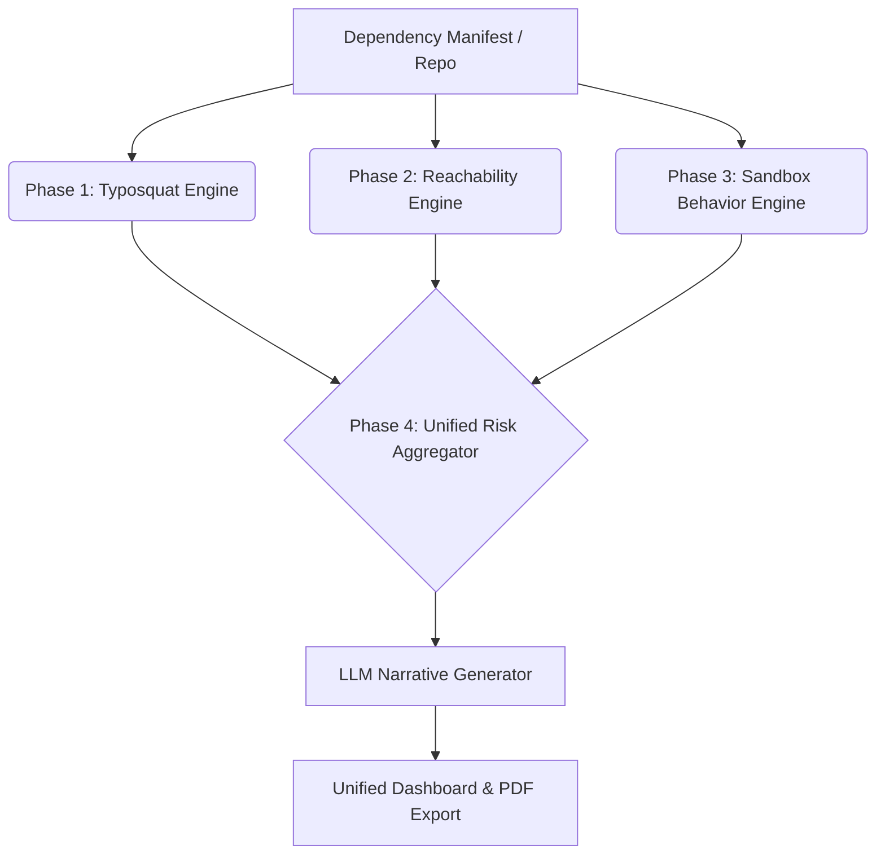

# Sentinel-Chain

A modern supply-chain security platform that proves exploitability rather than just flagging on package presence. Sentinel-Chain combines call-graph reachability analysis, sandboxed behavioral detection for malicious packages, typosquat detection, and AI-generated attack narratives into a single unified risk score per dependency.

## Architecture & Phases

Sentinel-Chain is built in four distinct analytical phases, culminating in a single unified dashboard.



### Phase 1: Typosquat Detector Engine
Scans `package.json` and `requirements.txt` files for dependencies that intentionally mimic top downloaded packages. It uses a combination of Levenshtein distance and QWERTY keyboard adjacency checks to accurately identify high-risk typos (e.g., `reqeusts` vs `requests`).

### Phase 2: Reachability-Aware CVE Analyzer
Maps your code's Abstract Syntax Tree (AST) using Tree-sitter to build a static call graph. It then correlates this with known vulnerabilities from OSV.dev and extracts patched function names from GitHub commits to determine if a vulnerability is actually **reachable** in your code. Integrates with FIRST.org EPSS API to factor real-world exploit probability into the risk score.

### Phase 3: Sandboxed Behavioral Detector
Runs the package installation inside an isolated Docker container and monitors system-level behavior (network calls, filesystem diffs, strace logs). It automatically flags packages that contact suspicious domains, write to critical paths (like `~/.aws/credentials`), or spawn malicious sub-processes during installation.

### Phase 4: Unified Risk Aggregator & LLM Narratives
Combines the findings from all three engines into a single weighted risk score (Low, Medium, High, Critical). It queries the Anthropic API (Claude 3.5 Sonnet) to generate 2-4 sentence plain-English explanations grounding the risk in the actual technical evidence, making the reports highly readable for non-security stakeholders.

## Tech Stack
- **Backend:** Python, FastAPI, Uvicorn, Tree-sitter, NetworkX, Docker API, Anthropic SDK
- **Frontend:** React, Vite, Tailwind CSS, html2pdf.js

## Running the Application

### 1. Configure the API Key
To enable the LLM Narrative Generator (Phase 4), you must provide an Anthropic API key. 
Create a `.env` file in the `backend` directory (or set it in your environment):
```bash
export ANTHROPIC_API_KEY="sk-ant-your-key-here"
```
*(Note: If the key is omitted, the engines will still run successfully, but the plain-English narratives will be skipped).*

### 2. Run with Docker Compose (Recommended)
1. Ensure Docker Desktop is running (required for Phase 3 Sandbox).
2. Run the following command in the root of this project:
   ```bash
   docker-compose up --build
   ```
3. Open your browser and navigate to:
   - Frontend Dashboard: [http://localhost:5173](http://localhost:5173)
   - Backend API Docs: [http://localhost:8000/docs](http://localhost:8000/docs)

### 3. Running Locally (Without Docker)

**Backend:**
```bash
cd backend
python -m venv venv
source venv/bin/activate  # or venv\Scripts\activate on Windows
pip install -r requirements.txt
uvicorn main:app --reload
```

**Frontend:**
```bash
cd frontend
npm install
npm run dev
```

## Dashboard & PDF Export
Navigate to the **Unified Scan (Phase 4)** tab to upload a project `.zip` file. Sentinel-Chain will orchestrate all engines, build the unified risk view, and allow you to export the findings as a clean PDF report for stakeholders.
